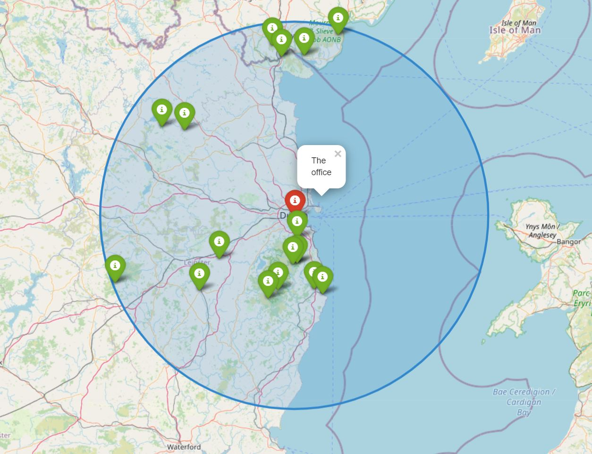

# The greate circle

*Find customers that are within 100km from dublin office to invite them for party.*

## Installation

* python3 (required)
* docker (optional)

Sample result file is stored here [output.txt](docs/output.txt)

To run the script, first install the requirements.

```bash
pip install -r setup/requirements.txt 
``` 

The main script is inside the greatcircle package, called `find_customers_within_circle.py`,

## Usage
```bash
usage: find_customers_within_circle.py [-h] --input INPUT [--output OUTPUT] [--radius RADIUS] [--plot]

optional arguments:
  -h, --help       show this help message and exit
  --input INPUT    Input customer data
  --output OUTPUT  output file name
  --radius RADIUS  Radius to search
  --plot
```

### Example 

Sample input data is stored here that can be used for testing [customers.txt](/tests/input/customers.txt)


```bash
python3 greatcircle/find_customers_within_circle.py --input tests/input/customers.txt 
``` 

With --range : 

```bash
 python3 greatcircle/find_customers_within_circle.py --input tests/input/customers.txt --range 200 
```

with --output: 

```bash
python3 greatcircle/find_customers_within_circle.py --input tests/input/customers.txt --output customers_within_100km.txt
```
generates a file with the given if any customers were found. 

with --plot

```bash
python3 greatcircle/find_customers_within_circle.py --input tests/input/customers.txt --plot
```

generate a html file with "customers_within_<range>_km.html", open in browser to see the plot.

Snippet of the generated html, below:



### To run the script in docker:

Build image 

```bash
docker build . --tag greatcircle:latest
``` 

To run
```
docker run --rm --name greatcircle greatcircle:latest --input customers.txt --range 200 --plot
```

### Test

Tests are inside /tests directory

```
python3 -m unittest tests/greatcircle_tests.py
```


